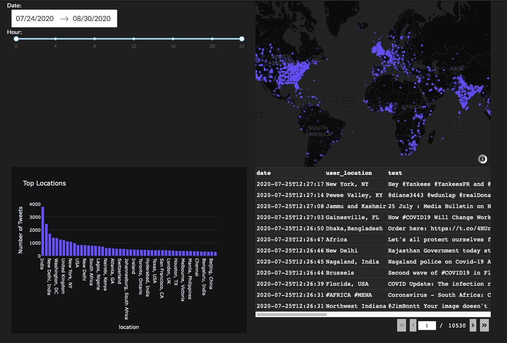

# Geo-Tagged Tweet Visualisation



This project visualizes geo-tagged tweets using a Dash web application. The application allows users to filter tweets by date and hour, and displays the data on a map and in a table.

## Requirements

To install the required packages, run:

```sh
pip install -r requirements.txt
```

## Data

The imported data frame should have the following columns:

- `date`: The date and time of the tweet.
- `text`: The content of the tweet.
- `lat`: The latitude of the tweet's location.
- `long`: The longitude of the tweet's location.

## Running the Application

To run the Dash application, execute:

```sh
python app.py
```

## Features

- **Date Picker**: Select a date range to filter tweets.
- **Hour Slider**: Select an hour range to filter tweets.
- **Tweet Map**: Visualize the location of tweets on a map.
- **Top Locations Bar**: Display the top 50 locations by the number of tweets.
- **Tweet Data Table**: View the filtered tweets in a table.

## File Structure

- `app.py`: The main Dash application.
- `data/`: Directory containing the data files.
- `requirements.txt`: List of required Python packages.

## License

This project is licensed under the MIT License.
